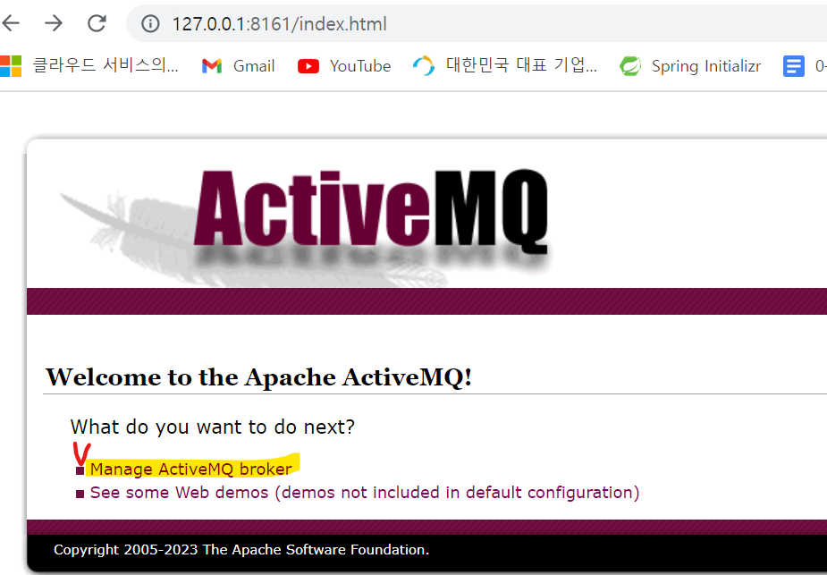

# activeMq 연동
{: .no_toc }

## Table of contents
{: .no_toc .text-delta }

1. TOC
{:toc}

## activeMQ 설치
<h3>activeMQ 설치방법</h3>

1) activeMQ사이트에서 os 버전에 맞는 설치 파일 설치

   - https://activemq.apache.org/components/classic/download/
   
2) activeMq 설정 변경
   - 수정파일 : apache-activemq-5.18.1-bin\apache-activemq-5.18.1\conf\activemq.xml
   
    1. beans 엘리먼트 아래와 같이 수정
    
      <beans
	  xmlns="http://www.springframework.org/schema/beans"
	  xmlns:xsi="http://www.w3.org/2001/XMLSchema-instance"
	  xsi:schemaLocation="http://www.springframework.org/schema/beans http://www.springframework.org/schema/beans/spring-beans.xsd
	  http://activemq.apache.org/schema/core http://activemq.apache.org/schema/core/activemq-core.xsd">
	  
	 2. <broker> 바로 위에 plugins 추가
	    <plugins>
        <simpleAuthenticationPlugin>
            <users>
                <authenticationUser username="admin" password="admin" groups="admins"/>
                <authenticationUser username="system" password="manager" groups="admins"/>
            </users>
            </simpleAuthenticationPlugin>
        </plugins>
        
.

2) actvieMq 실행하기
  - 위치 : C:\Tools\apache-activemq-5.18.1-bin\apache-activemq-5.18.1\bin\
  - cmd 창에서 activemq.bat start 수행

3) actievMq 모니터링
  - http://127.0.0.1:8161/index.html 접속
  - userid : admin / password : admin
  - 아래 메뉴 선택
	*   
	
4) 메뉴보기

<h3>activeMQ 샘플 소스</h3>
1) github 샘플 소스 git clone
  - https://github.com/ajcatambay/spring-boot-active-mq-demo
