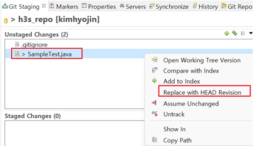

# git 연동
{: .no_toc }

## Table of contents
{: .no_toc .text-delta }

1. TOC
{:toc}

---
## 버전 관리
- 버전 관리 시스템에 대해 간단히 알아보자

    *   
    
1. 중앙집중식 버전 관리 (CVCS)

    1) 서버가 별도로 있고 클라이언트가 중앙 서버에서 파일을 받아 사용(Checkout)한다.
    
    2) 모두 누가 무엇을 하고있는지 알 수 있다. 관리자는 누가 무엇을 할지 꼼꼼하게 관리할 수 있다. 
    
    3) 치명적인 결점은 중앙 서버에 발생한 문제다.
    
    4) 서버가 다운되면 그동안 아무도 다른 사람과 협업할 수 없다

2. 분산 버전 관리 시스템 (DVCS) 

    1) 클라이언트는 단순히 파일의 마지막스냅샷을 체크아웃하지 않고 그냥 저장소를 히스토리와 더불어 전부 복제한다.
    
    2) 서버에 문제가 생기면 클라이언트 중에 아무거나 고른 복제물로 다시 작업을 시작할 수 있다.

## Gitgub - eclipse 연동 계정

- github과 eclipse 연동을 위한 패스워드 확인 방법

  1. github 웹사이트 접속 후 우측 상단 Settings 정보 선택
    *   
  
  2. 좌측 하단 Developer settings 선택
    *   
  	
  3. Personal access tokens > Tokens (classic) 선택
  	 *    
  
  
## Github - eclipse 저장소 연결
- github 저장소 연결하는 방법
  1. git clone
- 저장소에 프로젝트 올리기
  1. 이클립스 프로젝트 선택 > Team > Share Project
  2. Share Project 팝업에 Repository 선택
      *   
  3. Project가 연결된것으 볼 수 있다.
      *   
      - 이클립스 프로젝트와 github 연결만 된것이지 소스가 올라간 것은 아님
      
## Github - eclipse 저장소 파일 올리기
  1. 로컬 소스 github 저장소에 올리기 
  
     1) 이클립스 > 상단 Window > Show View > Git Staging 
     
     2) Git Staging
        
      Commit and Push 버튼 선택 
      
     	- Unstaged Changes : 수정한 파일을 아직 로컬 데이터베이스에 커밋하지 않은 상태
     	- Staged Changes   : 현재 수정한 파일을 곧 커밋할거라고 표시한 상태 (인덱스 파일에 기록)
     	- Committed        : 데이터가 로컬 데이터베이스에 안전하게 저장됨
     
      *   
      
     참고) git 세가지 상태
      + remote branch에 올리기 위해서는 네번째로 'Push'를 수행해야함
      + Working Directory는 프로젝트의 특정 버전을 Checkout한 것이다.
      + [보충설명](https://code-lab1.tistory.com/252)
      
      *   
      
     참고) 파일 변경에 따른 이클립스 아이콘 상태
      
      *   
     
      
## Check out
1. 브랜치 생성하고 원격 서버에 올리기
  
* 서버 Git 저장소에 저장된 프로젝트를 로컬 워킹 디렉토리에 CheckOut 한다
* main 브랜치가 아닌 작업을 위한 브랜치로 checkout한다
* 브랜치란 ? 다른 사람 작업에 영향을 받지않고 독립적으로 작업을 수행하기 위한 개념. 여러 작업을 동시 진행할 수 있다
   
	1) 로컬 Branch 생성
	{: .fw-800 }

		* 프로젝트 선택 > Team > switch To > New Branch
		* Branch name : {브랜치명} 입력 > ‘Finish’

	2) Branch 확인
	{: .fw-800 }
   
		* 프로젝트 선택 > Team > switch To > Others
		* Local 브랜치에 {브랜치명} 으로 로컬 Git 저장소가 생성된 것을 확인

	*   
   	
	3) 원격 저장소에 Push Branch
	{: .fw-800 }
	
		* 프로젝트 선택 > Team > Push Branch ‘{브랜치명}’
		* Push Branch {브랜치명} 팝업 > ‘Preview’ > ‘Push’ > ‘Close’
		* 프로젝트 선택 > Team > switch to > ‘Other’ > remote tracking 하위에 
     {브랜치명} 생성된것을 확인
		* Commit : 로컬 저장소 반영 / Push : 원격 저장소 서버 반영
		
	*   

2. 원격 서버에 브랜치를 로컬로 CheckOut

	1) 원격 서버 브랜치 CheckOut
	
		* Team > Switch to > Other
		
	*   

		* Check Out as a New Local Branch 선택
		
	*   
   		
3. Branch 변경하기

		* 프로젝트 선택 > Team > swtich to > Other 또는 Branch명 선택
		* 로컬 Git 저장소 or 원격 Git 저장소를 선택하여 워킹 디렉토리 Branch를 변경할 수 있음
		* master branch? 기본 브랜치로 master/slave 인종 차별적 느낌을 제거하기위해 main을 사용함(2.28버전~)
		* master = main 동일
		* 소스를 변경하고 사용하는 브랜치에 Commit(로컬 Git)/Push(원격 Git)한다
		
## 소스 변경하고 커밋하기
1. 소스 변경 후 커밋 (로컬 워킹 디렉토리에 저장)
2. 커밋한 소스 Push (원격 저장소에 올리기)

## 브랜치 병합
작업 브랜치에서 작업 완료 후 main 브랜치로 병합하기

1.khj SampleTest.java 수정, HjTest.java 추가 , commit and Push 완료
  - khj SampleTest.java 수정 이력 보기
  - 
  - HjTest.java 추가 이력 보기
  - 
  	
2.sjhan SampleTest.java 수정, commit and Push 완료
  - khj SampleTest.java 수정 이력 보기
  - 

3.main 브랜치로 khj, sjhan 브랜치 작업 병합하기 (conflict 없는 상태)
  - Team > Switch To > ‘main’ 
  - 프로젝트를 선택 후 ‘History’ 탭을 확인하면 아래와 같이 최초 커밋 이후 Main 의 이력이 없음을 확인
  - 

  - 첫번째로 khj 브랜치 작업 병합
  - Team > Merge
  - 
  - 프로젝트 선택 > History 탭을 확인해보면 origin/khj 작업이 병합된것을 확인할 수 있음
  - 
  
  - 두번째로 sjhan 브랜치 작업 병합
  - Team > Merge
  - 
  - 프로젝트 선택 > History 탭을 확인해보면 origin/sjhan 브랜치 작업이 병합된 후 
    새로운 Commit Id를 생성하여 origin/main 에 최종 커밋되는것을 알 수 있다. 
    (origin/khj, origin/sjhan 브랜치 작업이 병합되었다는 사실을 알 수 있다)
  - 

4.main 브랜치로 khj, sjhan 브랜치 작업 병합하기 (conflict 있는 상태)
  - Team > Merge
  - 
  -   
  - 라인을 수정하여 충돌을 없애고 Commit 또는 Push를 수행
  -   
  - 이력을 확인하여 브랜치 병합을 확인한다.
  - 
  
## 소스 원복하기
 

1) 변경한 소스를 서버의 마지막 저장 상태로 원복
{: .fw-800 }

 -  Git Staging > Unstaged Changes > Replace with HEAD Revision
 - 
	
2) 변경된 소스를 서버의 특정 버전 상태로 원복
{: .fw-800 }

## 변경 이력 확인
<h3>Git History</h3>

1) 프로젝트 선택 > Team > Show In History
 - 
 - khj, main 			   : 로컬 브랜치 워킹 디렉토리의 버전
 - origin/khj, origin/main : 서버 브랜치의 최종 버전
 - HEAD 				   : 현재 사용중인 브랜치의 마지막 커밋 버전
 

## 파일 무시하기
<h3>이클립스 프로젝트 설정파일과 같이 로컬에서 파일이 변경되도 무시하는 방법</h3>

1) git에서 파일 변경 추적하지 않기
 -  무시할 파일 또는 폴더 선택 > Team > Advanced > Assume Unchanged
 - 
 
2) git에서 파일 변경 추적하지 않는 모드 모두 해제하기
 - 프로젝트 선택 > Team > Advanced > No assume unchanged
